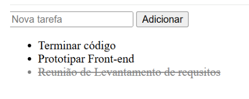

# Exemplos de Projetos em JavaScript ��

Este repositório contém diversos *exemplos práticos* demonstrando conceitos
e funcionalidades em JavaScript para criar aplicações interativas e dinâmicas.
Se você está aprendendo JavaScript ou buscando referências para melhorar
seus projetos, esse repositório é o lugar certo! ����

## O que é JavaScript? ��

JavaScript é uma linguagem de programação amplamente utilizada para criar
interatividade em páginas web. Ele permite manipular o DOM, criar animações,
gerenciar armazenamento local, fazer requisições assíncronas, tratar erros,
validar formulários e muito mais, tornando as aplicações web mais dinâmicas e
responsivas.

## Estrutura do Repositório ��

O repositório contém exemplos organizados em diferentes seções, que
incluem:

- **Manipulação do DOM**: Exemplos de como interagir e modificar elementos
HTML dinamicamente.
- **Estilização**: Demonstrações de como alterar estilos CSS via JavaScript.
- **Armazenamento Local**: Exemplos de uso do `localStorage` para persistir
dados no navegador.
- **Requisições Assíncronas**: Como fazer chamadas assíncronas com `fetch`
e gerenciar respostas.
- **Contadores**: Exemplos de criação de contadores interativos.
- **Animações Simples**: Demonstrações de animações básicas usando
JavaScript.
- **Listas de Tarefas**: Exemplos de gerenciamento de listas dinâmicas, como
&quot;to-do lists&quot;.
- **Validação de Formulários**: Como validar dados de formulários em tempo
real.

- **Tratamento de Erros**: Exemplos de como capturar e tratar erros em
JavaScript.
- **Funções Assíncronas**: Uso de `async/await` para gerenciar operações
assíncronas.
- **Menus Interativos**: Exemplos de menus, como o menu hamburger.
- **Carrosséis**: Demonstrações de criação de carrosséis interativos.

## Como Usar ��‍��

1. Clone o repositório:
```bash
git clone https://github.com/SesiSenaiDA2025/javascript-exemplos.git
```

2. Acesse o diretório:
```bash
cd javascript-exemplos
```

3. Abra o arquivo HTML desejado no seu navegador para ver o exemplo em
ação! ��

*Dica*: Se você preferir rodar os exemplos localmente com um servidor, pode
usar o *Live Server* do VSCode ou algum outro servidor local de sua
preferência.

## Licença ��

Esse projeto está licenciado sob a licença **MIT**. Veja o arquivo LICENSE
para mais detalhes.

## Exemplos de Tela ��

1. *Exemplo de Lista de Tarefas*:


2. *Exemplo de Carroussel Interativo*


## Contato ��

Se você tiver alguma dúvida ou sugestão, fique à vontade para me contatar
diretamente através do meu e-mail: exemplo@gmail.com.

*Desenvolvido por SENAI/SESI 2DA | 2025*